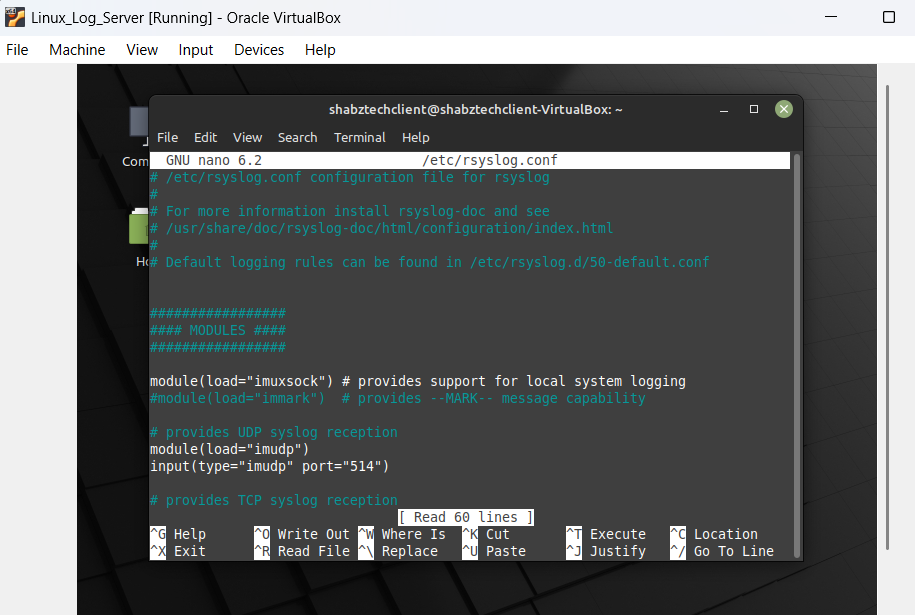
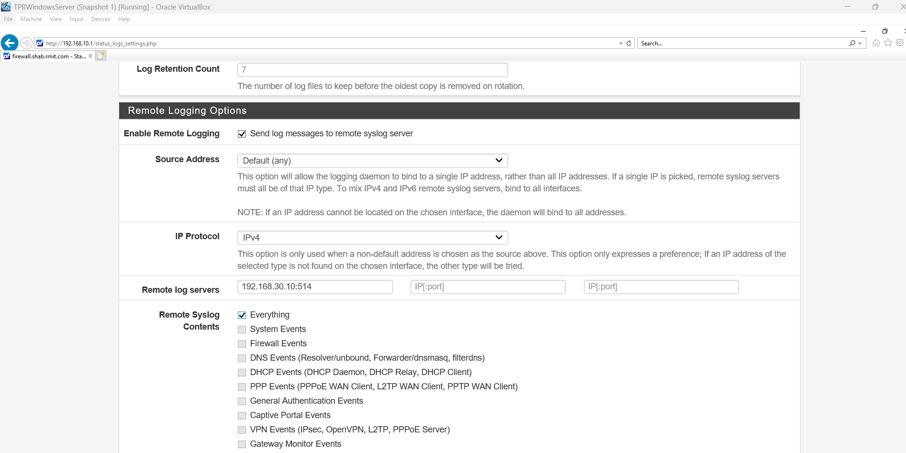

# Lab 10: Syslog Aggregation & Centralized Logging

### Building the Network's "Flight Recorder"

The previous labs were about building the walls (Architecture) and hiring the guards (IDS).

The firewall and servers were generating logs, those logs were scattered across different virtual machines. If an attacker compromised one of them, the first thing they would likely do is delete the logs to cover their tracks. I learned that in a Security Operations Center (SOC), "scattered logs" are as good as "no logs."

In this lab, I reclaimed my "Server Zone" (VLAN 30) to deploy a dedicated Log Receiver—a "Black Box" that records everything happening on the network in real-time.

### What I Did (The Technical Stuff)

I moved from simple server administration to configuring the backend infrastructure required for network forensics. Here is the breakdown:

- **Infrastructure Expansion:** Since I moved my previous server to the DMZ in Lab 8, I spun up a new Ubuntu Server in <u>VLAN 30 (192.168.30.10)</u> to act as the dedicated repository for log data.

- **Configuring the Receiver (Rsyslog):** I dove into the Linux configuration files (/etc/rsyslog.conf) to enable the imudp module.
  
  - This effectively opened **UDP Port 514**, turning the server from a passive machine into an active listener waiting for log messages.

- **Configuring the Sender (pfSense):** I configured the "Remote Logging" settings on the firewall, directing it to send a copy of all system, firewall, and DNS events to my new internal server.

### Cybersecurity Fundamentals in Action

This lab wasn't just about moving text files around; it was about ensuring **Visibility** and **Data Integrity**:

- **Aggregation & Correlation:** I learned that analyzing logs in isolation is difficult. By aggregating them into a single location, I am laying the foundation for correlation (seeing how an event on the Firewall relates to an event on a Server).

- **Forensic Integrity:** This setup supports the concept of *Non-Repudiation*. By shipping logs off the firewall immediately, I ensure that even if the firewall is hacked and wiped, the evidence of the intrusion is preserved safely in the Server Zone.

- **Protocol Knowledge:** I got hands-on experience with the standard Syslog Protocol (UDP 514). I learned that while UDP is fast (fire-and-forget), it doesn't guarantee delivery—a trade-off often made for high-volume logging.

### Verification: The Matrix Effect

I validated the setup by running a live "tail" on the log file while generating traffic on the firewall.

- **The Test:** I ran <u>tail -f /var/log/syslog</u> on the Ubuntu server and then triggered some noise on the pfSense interface.

- **The Result:** Watching the logs scroll by in real-time was incredibly satisfying. I could see the exact moment my firewall made a decision, appearing instantly on a completely different server. It felt like I finally had a pulse on the network.

### What's Next?

My infrastructure is built, my target is in the DMZ, and my "Flight Recorder" is recording. The defensive architecture is complete.

I am now ready to switch hats and move to the next phase, The Attack. In the next lab, I will deploy Kali Linux and start testing these defenses to see if my logs actually catch the bad guys.
