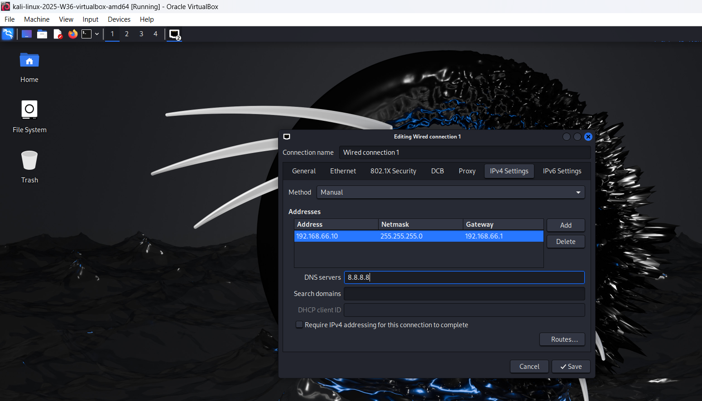
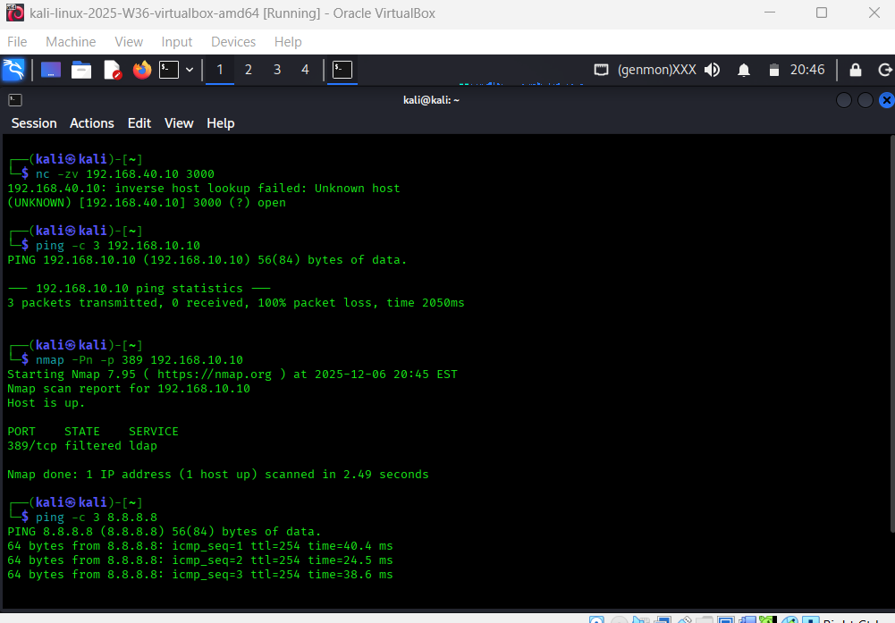
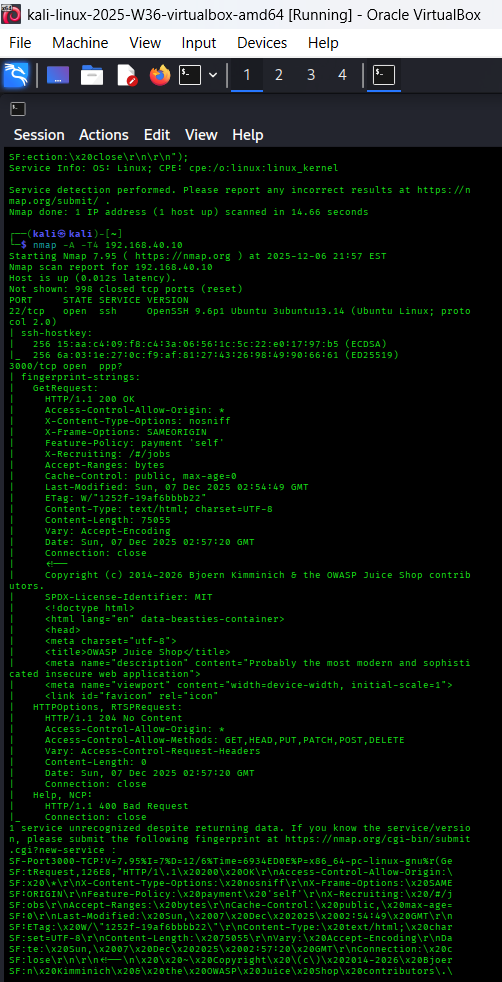

# Lab 11: The Attack (Red Team Operations)

**"You cannot defend what you cannot simulate."**

Up until now, I’ve been wearing the "Architect" hat—building VLANs, configuring firewalls, and setting up logging servers. But a security lab isn't very useful if nothing ever happens in it.

In this phase, I switched hats to the "Red Team." I deployed a Kali Linux machine in a dedicated subnet (VLAN 66). My goal wasn't just to hack for fun, but to generate specific "noise" to test if my Blue Team defenses (Suricata IDS and Syslog) were actually working.

## Part 1: Reconnaissance (Lab 11)

Before I could attack the target (the Ubuntu server in the DMZ running Juice Shop), I needed to find it. I used Nmapto map out the network and identify open ports.

### The Setup

I ensured my Suricata IDS was actively watching the DMZ interface on the firewall. If I didn't do this, my scans would be invisible to the logs (which defeats the whole purpose of the lab!).

### The Attack

From my Kali machine (192.168.66.10), I ran a few scans against the target IP (192.168.40.10):

1. **Service Enumeration:** I used nmap -sV to see exactly what versions of software were running.

2. **The "Loud" Scan:** I ran nmap -A -T4. This throws everything at the target—OS detection, scripts, and traceroutes. In a real stealth operation, this would be sloppy, but here I wanted to set off the alarms.

### Validation

I logged into the pfSense web interface to check the Suricata Alerts tab.

- **Evidence:** The dashboard lit up with red alerts.

- **Specific Alert:** ET SCAN Nmap Scripting Engine User-Agent.

- **Result:** The IDS successfully identified the source IP (192.168.66.10) scanning the victim (192.168.40.10).

---

## Part 2: Exploitation & Identity Noise

Mapping the network is one thing, but I needed to generate "high severity" logs for my future SIEM to ingest. Nothing screams "Security Incident" quite like thousands of failed password attempts in a few seconds.

### The Weapon: Hydra

I used **Hydra** combined with the famous rockyou.txt wordlist. If you don't know rockyou.txt, it's a massive list of terrible passwords that people actually use. It’s a sobering reminder to use a password manager.

### The Attack

I launched a brute-force attack against the SSH service on the DMZ server. I wasn't necessarily trying to get in; I just wanted to flood the authentication logs.

My command looked something like this:

hydra -l administrator -P /usr/share/wordlists/rockyou.txt ssh://192.168.40.10 -t 4.

### Validation: Tracking the Evidence

This was the critical test. Since I set up a Centralized Log Server in the previous phase, the logs shouldn't just be on the victim machine—they should be safely stored in my secure Server Zone (VLAN 30).

**1. On the Victim (DMZ Server):** I checked /var/log/auth.log and confirmed the attack was hitting the disk.

grep "Failed password" /var/log/auth.log.

**2. On the Central Log Collector (VLAN 30):** I logged into my Log Server (192.168.30.10) and checked the central dump:

tail -f /var/log/syslog | grep "ssh".

**Result:** I watched in real-time as thousands of "Failed password for administrator" logs streamed in from the DMZ server.

---

## Reflection

Honestly, seeing the logs appear instantly on a completely different server in a different VLAN was pretty satisfying. It proved that my firewall rules allow the logs to traverse the network while still blocking the attacker from reaching the internal zones.

Now that I have a mountain of log data, the next step is to make sense of it all. Next up: SIEM Deployment with Wazuh.
