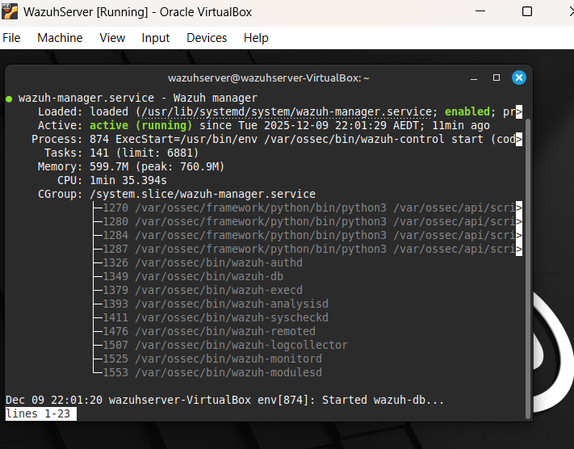
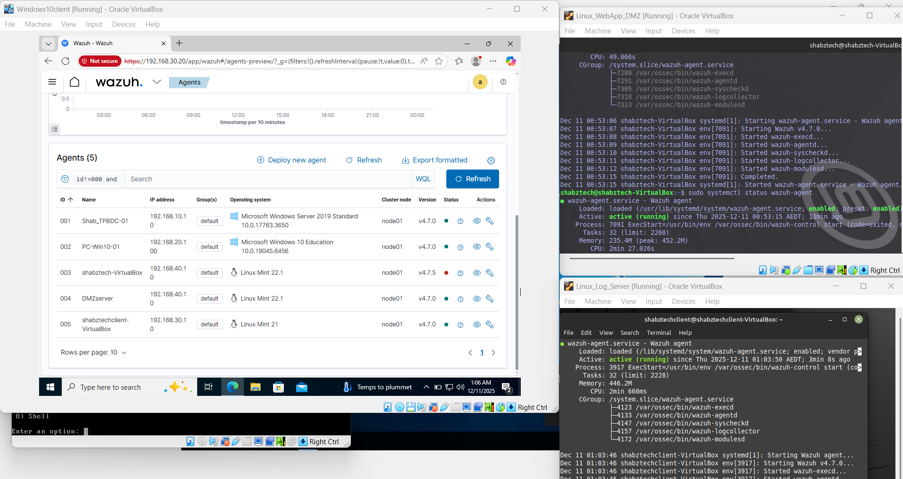
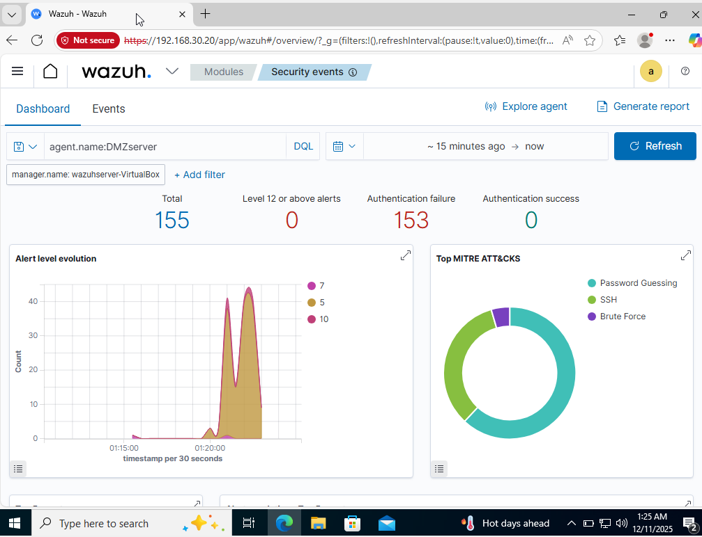
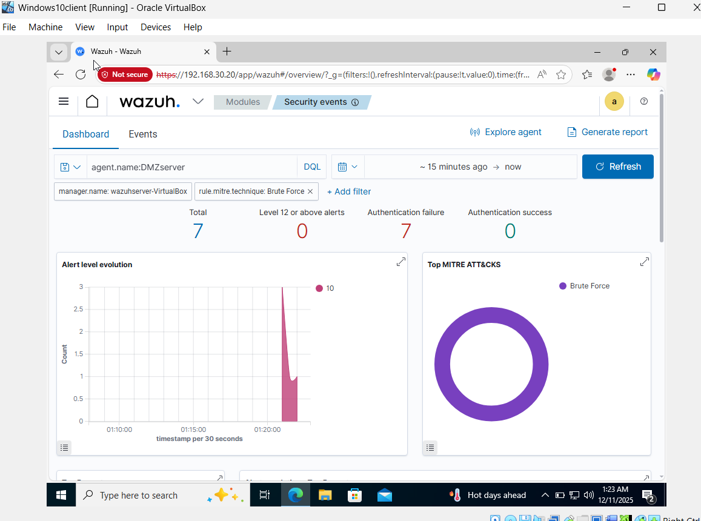

# Lab 14 - 15: From Logs to Insights (SIEM, Analysis, and Visualization)

Up until now, I've played a few different roles: the Architect (building the network), the Plumber (centralizing logs), and the Red Team operator (generating attack traffic). All those previous steps were in preparation for this final, critical phase.

In this lab, I deployed a Security Information and Event Management (SIEM) system. A SIEM is the brain of a modern Security Operations Center (SOC). It takes all the scattered logs from firewalls, servers, and IDS, makes sense of them, correlates them, and raises a clear alarm when something bad is happening.

My goal was to stop looking at thousands of lines of raw text and start seeing a dashboard that told a story.

## SIEM Deployment with Wazuh

I chose to work with Wazuh, an open-source security platform. It's more than just a log collector; it's a full SIEM solution that provides threat detection, vulnerability management, and configuration assessment.

### The Components

A typical Wazuh deployment has three main pieces:

1. **Wazuh Manager:** Installed on my Central Log Server (VLAN 30), this is where all the logs are collected, analyzed against built-in rules, and stored.

2. **Wazuh Agent:** A small piece of software I installed on my target DMZ server. Its job is to watch the crucial files (like /var/log/auth.log for SSH attacks) and send that data securely to the Manager.

3. **Elastic Stack:** This component provides the beautiful web interface for searching, visualizing, and interacting with the data the Wazuh Manager is processing.

### The Technical Setup

This phase required a solid understanding of Linux administration and networking.

- **Securing the Communication:** I had to ensure the Wazuh Manager and Agents could communicate securely through the firewall. This meant creating specific firewall rules to allow the necessary ports (like 1514 for agent registration and 55000 for log forwarding) between the DMZ (VLAN 40) and the Server Zone (VLAN 30).

- **The Agent Enrollment Process:** I used a simple command to enroll the Agent on the DMZ server with the Manager. This is a crucial step where a unique key is exchanged, allowing the Manager to trust the data coming from that specific server.

## Threat Hunting & Alert Correlation

Once the Wazuh platform was running, the difference was immediate. The raw, messy logs from the Red Team exercise (Lab 11) were instantly transformed into clear, categorized security alerts.

### Analyzing the Red Team Attack

I focused specifically on the loud attacks I generated: the Nmap scan and the Hydra brute-force attempt.

- **The Hydra Attack (Failed Logins):**
  
  - The thousands of "Failed password" logs I generated were automatically aggregated. Instead of seeing 5,000 individual logs, Wazuh fired a single, high-severity alert for "SSH brute force attack" with a count of attempts.
  
  - **Learning Moment (Tuning):** This aggregation is based on a concept called Active Response within Wazuh. If a certain number of failed logins occur in a short period, the system's rule engine triggers a high-level alert, allowing an analyst to focus on the incident, not the noise.

## The Story in the Dashboard

The final step was to use the visualization tools provided by Kibana to make the data consumable for a security team. Raw data is useless; visualized data is actionable.

### Creating Key Visualizations

I worked on building simple dashboards to quickly communicate the current security posture.

- **Top 5 Attack Sources:** A simple bar chart showing the source IP addresses that generated the most alerts. Unsurprisingly, my Kali machine (192.168.66.10) was at the top. This immediately tells an analyst where to focus their attention.

- **Alert Severity Pie Chart:** A pie chart breaking down alerts into High, Medium, and Low severity. The goal is always to reduce the "High" and "Critical" slices. The Hydra and Nmap attacks were clearly categorized as High/Critical, confirming the system's ability to prioritize threats.

- **Log Over Time:** A line graph tracking the number of events per minute. This visualization is essential for detecting anomalies. When I ran the Red Team scan, I saw a clear, massive spike, a "spike anomaly", which is the classic signature of an attack.

## Reflection & Conclusion

This lab was the culmination of every previous step. I started with cables and IP addresses and finished with a working, automated threat detection system.

The biggest takeaway for me was realizing that Defense is about Context. The SIEM takes isolated pieces of information (a log here an IDS alert there) and provides the context needed to declare a full-blown security incident. Watching my deliberate attack be instantly translated into a high-severity, dashboard-visible alert proved that my network defenses were not just configured, but were genuinely effective.

I now have a robust home lab environment ready for continuous learning, focused on how a true SOC environment operates.
