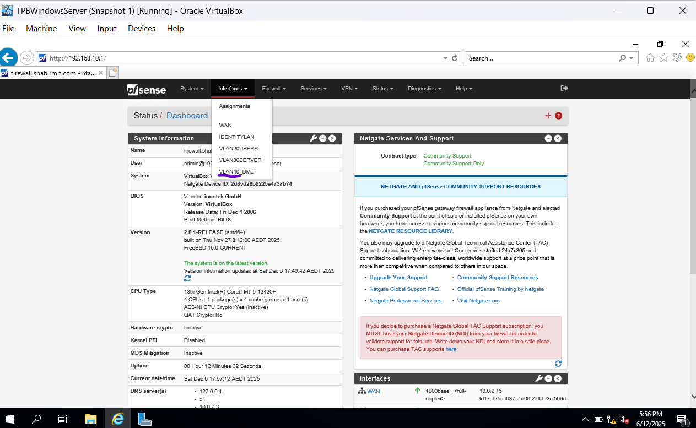
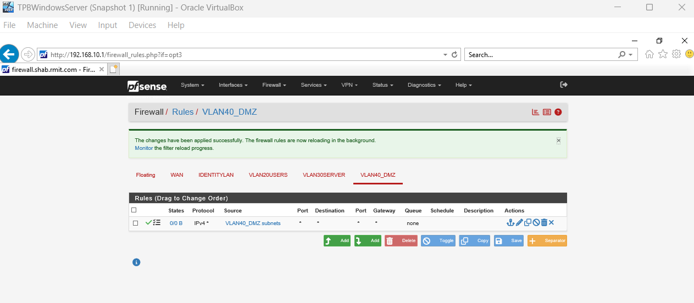
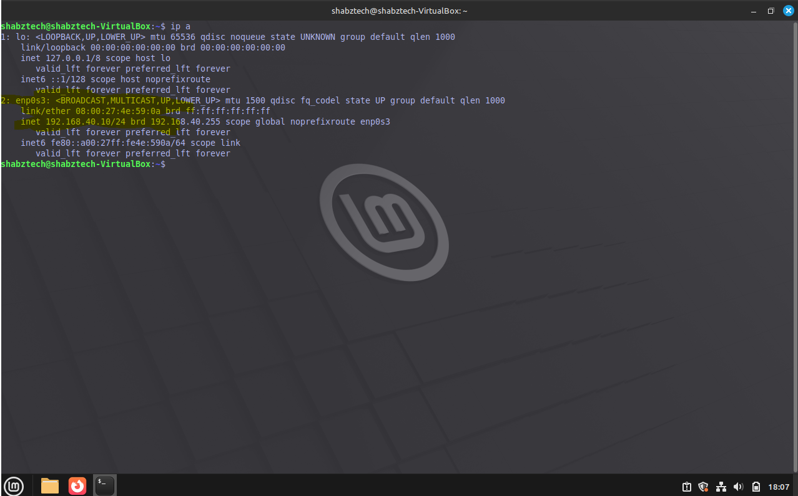
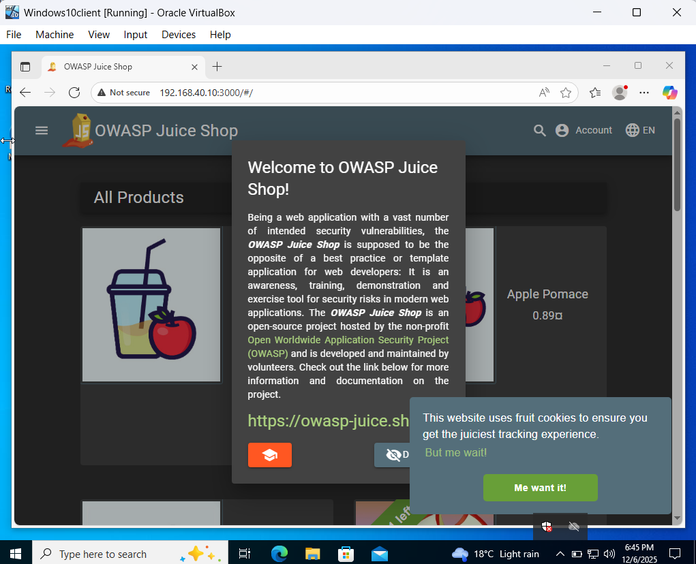

# Lab 9: The DMZ & Dockers - Deploying Web App Infrastructure

### Entering the Danger Zone

After spending the last few labs locking everything down—configuring Firewalls, setting up IDS sensors, and restricting file permissions—it felt a bit strange to intentionally deploy something designed to be broken. But as I'm learning, you can't test your defenses if you don't have anything to attack.

In this lab, I architected a DMZ (Demilitarized Zone). In the real world, this is where you place public-facing services (like Web Servers). The logic is simple but critical: if this web server gets compromised, the attacker is "trapped" in the DMZ and can't easily pivot to the internal "User" or "Identity" VLANs I built earlier.

This lab required me to step out of the comfort of the graphical interface and dig into the hypervisor’s command line to expand my network topology.

### What I Did (The Technical Stuff)

I transitioned my Ubuntu Server from a secure internal server to an exposed web target. Here is the breakdown:

- **Bypassing Hypervisor Limits:** I ran into a hurdle where the VirtualBox GUI only allows four network adapters. Since I needed a 5th interface for the DMZ, I had to use the CLI tool VBoxManage to manually inject a 5th virtual NIC into my pfSense firewall. It was a great lesson that the GUI doesn't always show you the full capabilities of the underlying engine.

- **Network Segmentation:** I configured a new interface on pfSense (192.168.40.1) to serve as the gateway for the new VLAN 40 (DMZ).

- **The Migration:** I moved the Ubuntu Server from the "Server Zone" (VLAN 30) to this new DMZ. This involved updating the Netplan configuration to assign a new Static IP (192.168.40.10) and verifying routing through the firewall.

- **Containerization with Docker:** Instead of installing a web app directly onto the OS, I installed Docker. This allowed me to pull the OWASP Juice Shop container—a modern web application designed with intentional security flaws (SQL Injection, XSS, etc.) for security training.

### Cybersecurity Fundamentals in Action

This lab was about architecture and isolation strategies:

- **Network Segmentation & Containment:** The core lesson here was Traffic Isolation. By placing the Juice Shop in a DMZ, I am preparing for a "breach assumption." If an attacker owns the web app, they are separated from my Domain Controller in VLAN 10.

- **Hypervisor Networking:** I learned how to manipulate promiscuous mode and virtual cabling via the command line, ensuring that my firewall (and my IDS) can actually see the traffic flowing to this new zone.

- **Modern Application Deployment:** Using Docker showed me how modern apps are shipped. It also highlighted a security reality: containers are convenient, but if the application inside them is vulnerable, the ease of deployment just means you can deploy vulnerabilities faster!

### Verification: The Target is Live

To verify the architecture, I went to my Windows 10 Client in the User Zone (VLAN 20) and navigated to the new DMZ IP address.

- **The Test:** Accessing http://192.168.40.10:3000 from the browser.

- **The Result:** The Juice Shop storefront loaded immediately.

This confirmed that my routing rules allow users to access the DMZ, but the infrastructure is now physically (virtually) segmented.

### What's Next?

I now have an almost complete "Victim" environment: An Active Directory for Identity, a Client for User traffic, and a Vulnerable Web App for exploitation. The stage is set...Almost! Final edition is required to be added which is the eyes. In the next short lab, we will implement syslog aggregation and then our enviroment will be ready to pivot to the Red Team. We will launch attacks against this infrastructure and see if my IDS (Suricata) can catch them.