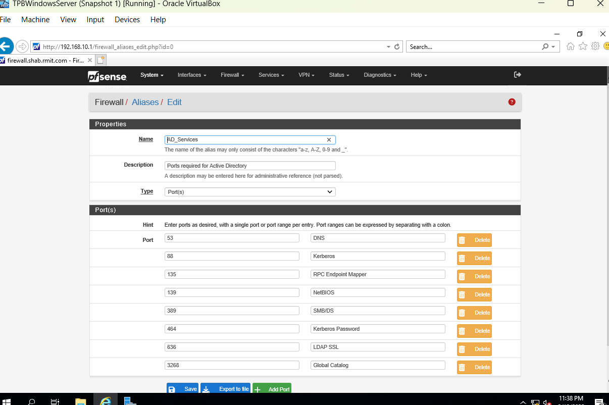
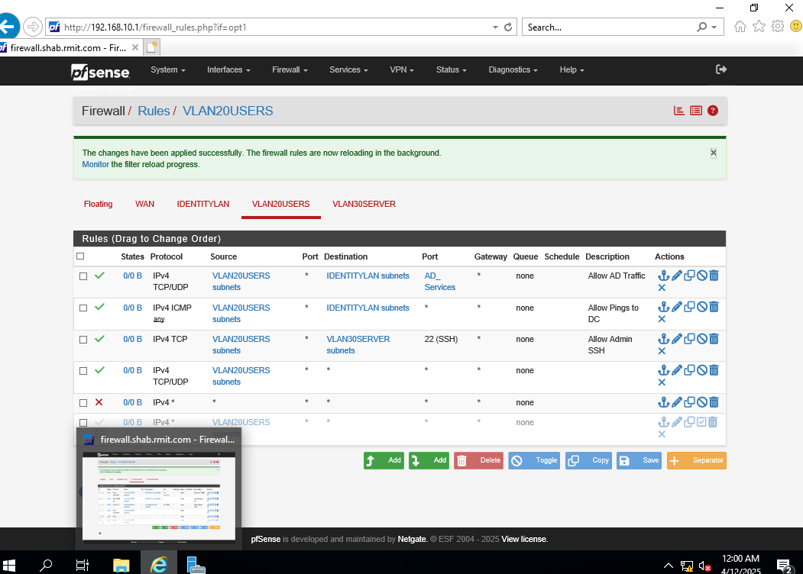
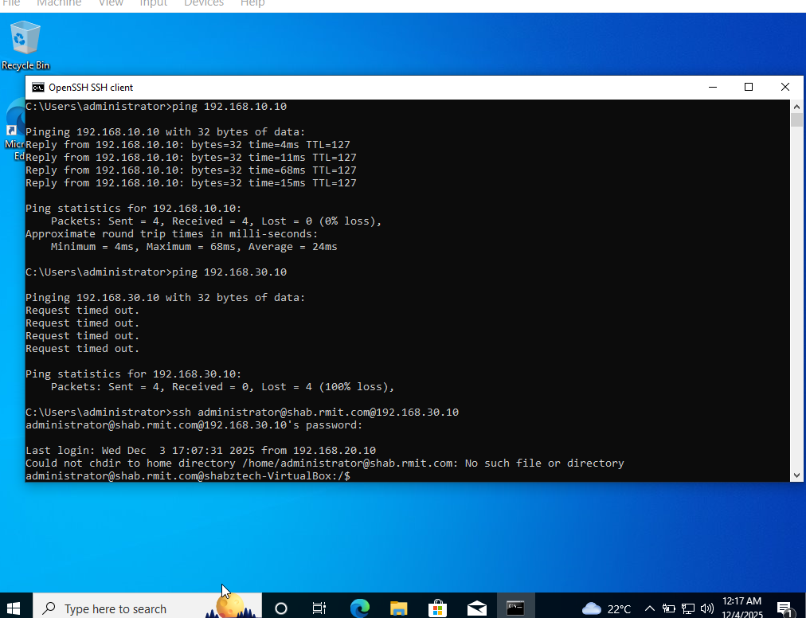
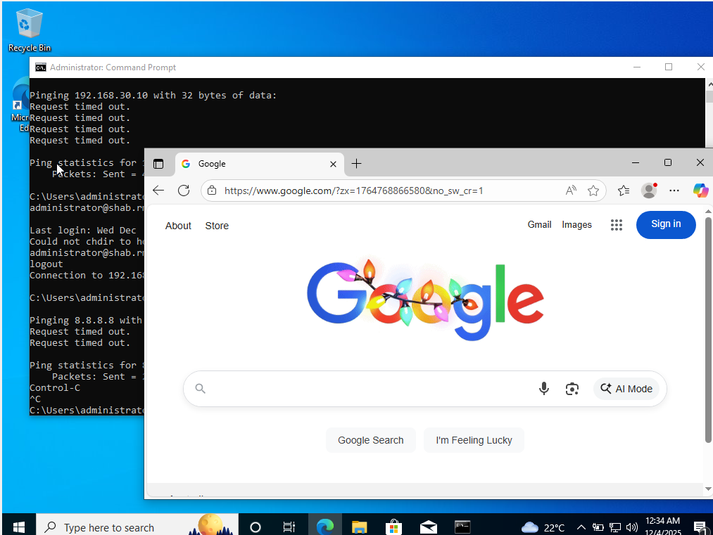
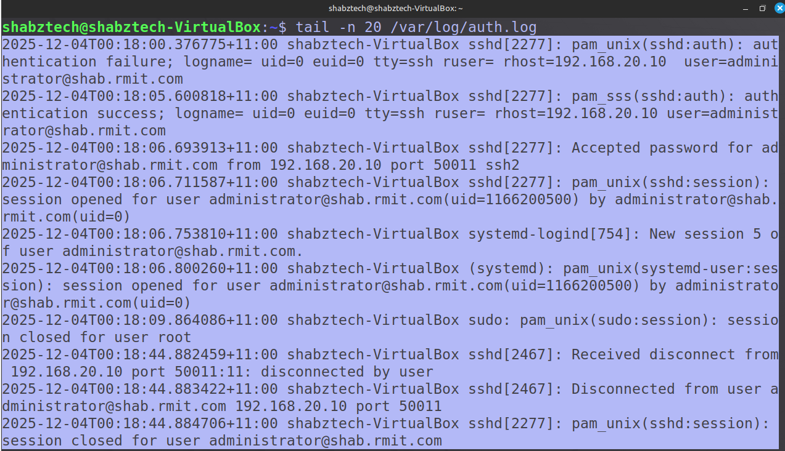

# Lab 4: Security Hardening & Policy Implementation

### Objective

Transition the network from a "functional" state (Allow All) to a "Secure by Design" state. Implement Firewall rules to limit traffic at the network layer and prepare the network for future SIEM ingestion and simulated attacks.

### Architecture & Changes

#### 1. Network Hardening: Firewall Logic (pfSense)

The core objective was to eliminate the default "Pass Any" rules and replace them with precise, stateful access controls.

#### 1. Service Aliasing

I logged into pfSense and I created a Port Alias that included a set of defined Ports required for Active Directory Communications.

- **Alias Name:** AD_Services

- **Defined Ports:**
  
  - 53 (DNS)
  
  - 88 (Kerberos)
  
  - 135 (RPC Endpoint Mapper)
  
  - 139 (NetBIOS)
  
  - 389 (LDAP)
  
  - 445 (SMB/DS)
  
  - 464 (Kerberos Change Password)
  
  - 636 (LDAP over SSL)
  
  - 3268 (Global Catalog)

#### 2. Least Privilege Rulebase (User Zone)

I set the firewall rules for the the Users Vlan to follow a strict "Top-Down" processing logic:

## Validation

---

### System Hardening: Linux (Ubuntu Server)

The Linux Machiner (Vlan 30) needed to be hardened to prevent unauthorized access to root user and ensure security logs were being collected.

#### SSH Configuration

I modified the specific daemon configuration file /etc/ssh/sshd_config to enforce user-based accountability.

- **Directive:** PermitRootLogin prohibited-password

- **Directive:** PasswordAuthentication yes

- Restart ssh
  
  Directive means a comment with # at the front inside the config file. I simply deleted the #, saved and exited out of the file. 
  
  Now I have disabled the direct use of the root account via SSH. The administrators must log in as a named user (e.g., administrator@shab.rmit.com) and escalate privileges via sudo. 
  
  By doing this, auth.log (our log file) will show which user logged in first before root user was accessed.

**Validation:**

### Policy Implementation: Windows (Group Policy)

Okay I hardened the Security for our User Vlan but I used the Active Directory Group Policy Objects (GPO) to prepare the network for future "Red Team" activities and "Blue Team" detection. At the same time, I also used GPO to enable auditing and ensure SIEM receives high quality data

#### 1. Security Visibility (Auditing)

- 1. Log into Windows Server 2019 (DC).
  
  2. Open Group Policy Management (gpmc.msc).
  
  3. Expand your Forest > Domains > shab.rmit.com
  
  4. Right-click Default Domain Policy > Edit.
     
     - *Architect's Note:* In production, we make a new GPO. For this lab, editing Default is fine.
  
  **Navigate to:** Computer Configuration > Policies > Windows Settings > Security Settings > Advanced Audit Policy Configuration > Audit Policies
  
  **Configure these settings:**
  
  1. Account Logon:
     
     - Audit Credential Validation -> Success and Failure
  
  2. **Logon/Logoff:**
     
     - Audit Logon -> Success and Failure
  
  3. **Detailed Tracking:**
     
     - Audit Process Creation -> Success (Crucial for seeing what malware runs later).
