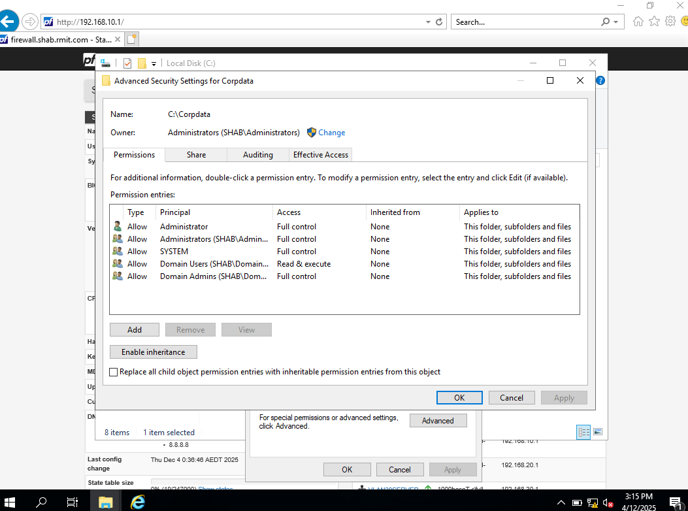
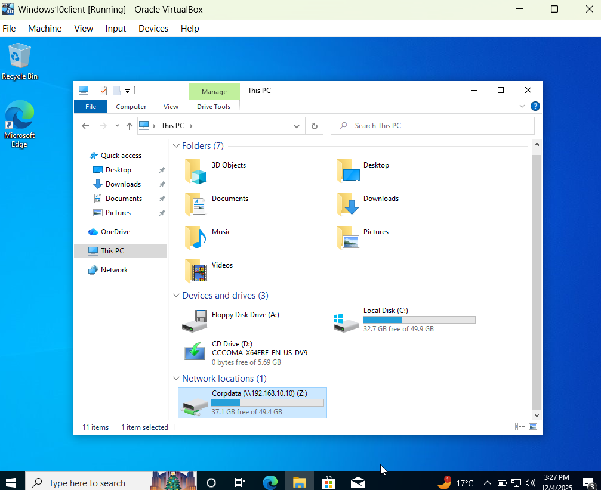
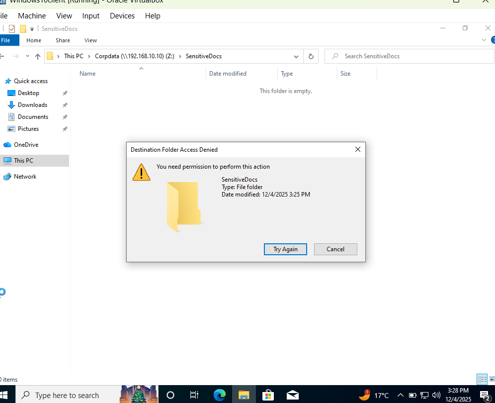

# Lab 6: File Services & Access Control (IAM)

### From Locking Doors to Locking Drawers

If Lab 5 was about locking the front door (Hardening & Firewalls), Lab 6 was about making sure the guests don't start rummaging through the master bedroom.

I realized that securing the network pipes is only half the battle; you also have to secure the data flowing through them. In this phase, I transitioned from "Network Security" to Identity and Access Management (IAM). I set up a corporate file share and—crucially—learned that "Everyone" definitely does not deserve "Full Control."

This is something I have been exposed to for years and years from a client/user prospective. Now in this Lab I get behind the scene to implement it.

### What I Did (The Technical Stuff)

I simulated a sensitive corporate environment where data needs to be accessible but protected. Here is the breakdown:

- **Identity Management:** I went into Active Directory Users and Computers and created a Standard User account (Bob Smith) to simulate a regular employee.

- **File Share Configuration:** I created a directory structure (C:\CorpData\SensitiveDocs) on the Domain Controller to act as our central data repository.

- **Permissions Layering:** I learned the difference between Share Permissions and NTFS Permissions.
  
  - Share Level: I removed the default "Everyone" group and added "Domain Users".
  
  - NTFS Level: I disabled inheritance to break the chain from the parent drive, ensuring tight control.

### Cybersecurity Fundamentals in Action

This lab was a practical application of the Principle of Least Privilege and the CIA Triad (Confidentiality, Integrity & Availability):

- **Least Privilege:** I configured the permissions so that "Domain Admins" have Full Control, but standard "Domain Users" only have Read & Execute access. This ensures users can do their jobs (read files) without the ability to accidentally (or maliciously) delete them.

- **Integrity (CIA):** By denying write access to standard users, I ensured the *ntegrity of the data.

- **Defense in Depth:** I used two layers of access control (Share + NTFS) to ensure that if one configuration fails, the other still restricts access.

### Verification: The Joy of "Access Denied"

I validated the setup by logging in as Bob Smith on my Windows 10 Client (VLAN 20) and attempting to write a file to the SensitiveDocs folder.

- **Result:** Windows threw an Access Denied error.

- **Why I smiled:** usually, errors are frustrating, but in this case, seeing that error message meant my security policies were working exactly as intended!

### What's Next?

Now that I have a secured network (Lab 5) and secured data (Lab 6), I’m ready to move on to Lab 7, where I'll be looking at Centralized DHCP to make managing these IPs a little less manual.
