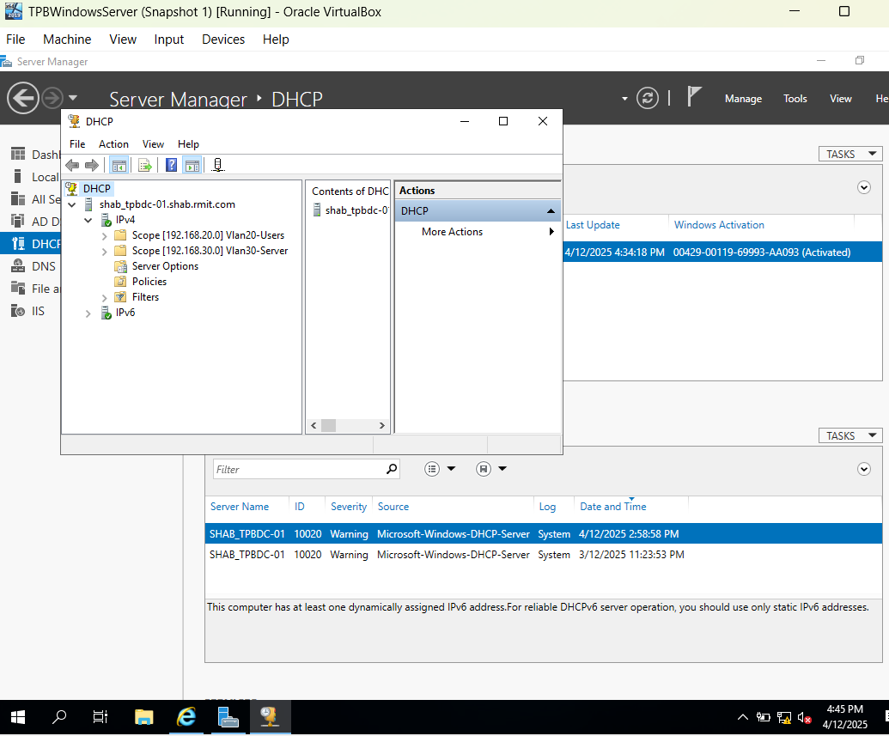
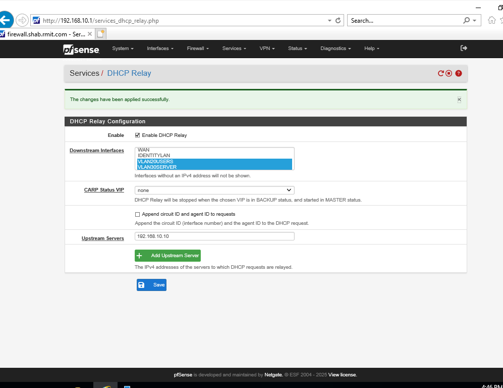

# Lab 7: Centralized DHCP

### From Manual Labor to Automated "Shouting"

Lab 7 is about automating the connectivity that allows users to reach it.

Up until now, I’ve been manually assigning Static IPs to every machine I built. While that works for a tiny lab, in a real enterprise, manual IP management is a nightmare that doesn't scale. In this phase, I moved from "Manual Configuration" to automated "Centralized Management." I learned that DHCP is basically just a computer shouting into a room—and when that room is a VLAN, the walls are soundproof.

### The Technical Stuff

I transitioned my network from a static setup to a dynamic, scalable enterprise environment.

- **Server Role Deployment:** I installed and authorized the DHCP role on my Windows Server 2019 (Identity Zone) to act as the single source of truth for IP addresses.

- **Scope Creation:** I defined a specific pool of addresses (Scope) for the User VLAN (192.168.20.100-199) and—crucially—configured the Scope Options to ensure clients are given the correct Gateway (.20.1) and DNS Server (.10.10).

- **Bridging the Gap (The Relay):** I configured a DHCP Relay on the pfSense firewall.
  
  - The Problem: DHCP uses Broadcast traffic, which routers (like pfSense) block by default to keep networks separate.
  
  - The Solution: I set up the Relay agent to "listen" for shouts in the User VLAN and "forward" them via unicast to the DHCP Server in the Identity VLAN.

### Networking Fundamentals in Action

This lab was a practical application of Layer 2/Layer 3 boundaries and Availability:

- **Broadcast Domains:** I learned that VLANs are strictly isolated broadcast domains. Without the Relay agent acting as a bridge, the Client (VLAN 20) and Server (VLAN 10) are effectively on different planets regarding discovery traffic.

- **Availability (CIA):** By automating IP assignment, I ensured that any new client added to the network immediately has availability to network resources without administrative intervention.

- **Observability:** By forcing clients to use the Windows Server for DHCP (instead of the firewall), I ensured that the Server updates its local DNS records automatically. This means I can now track devices by Hostname rather than just random IP addresses—huge for security logging later.

### Verification: The Magic of "Obtain Automatically"

I validated the setup by wiping the static IP from my Windows 10 Client (VLAN 20) and setting it to "Auto."

- **The Test:** I ran ipconfig /release and ipconfig/renew in PowerShell.

- **The Result:** The client pulled 192.168.20.100, found the Gateway, and successfully pinged Google.
  
It seems simple, but realizing that my Windows 10 PC sent a packet that hit the Firewall, got picked up by the Relay, was carried to the Server, got an answer, and came all the way back—all in a split second—was genuinely cool to watch.

### What's Next?

Now that my clients are managed and automatically connected, I’m ready to move on to **Lab 8**, where I'll be deploying **Suricata IDS** to start monitoring the traffic I just enabled.
