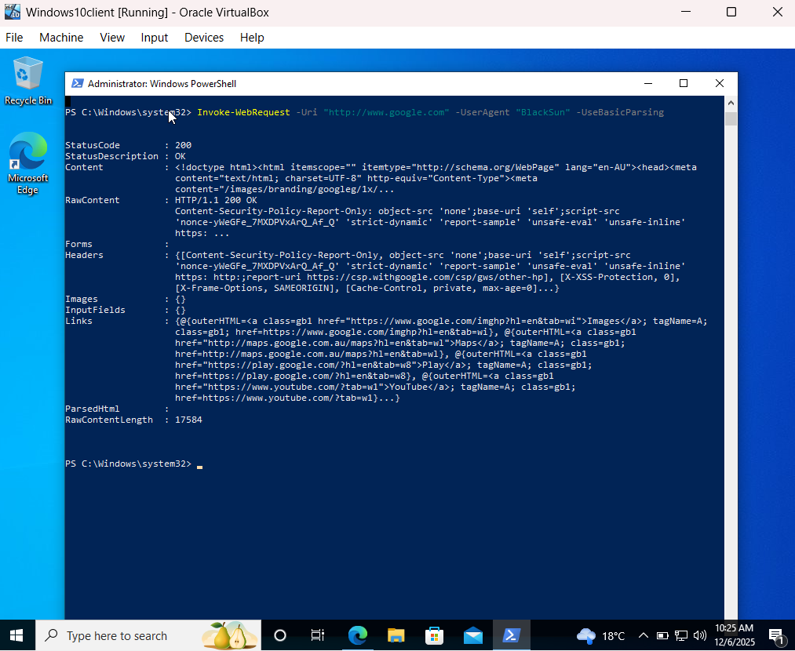
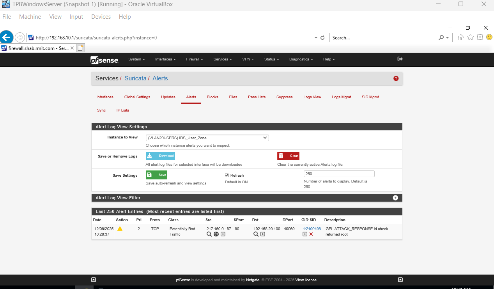

# Lab 8: Intrusion Detection (IDS) – Suricata

### From Traffic Cop to Security Analyst

In the previous labs, I built a functional network with firewalls, identity management, and centralized DHCP. But I realized I had a major blind spot: my firewall was acting like a bouncer checking IDs (IP addresses and ports), but it wasn't checking *what* the guests were carrying in their pockets (payloads).

If an attacker communicated over an allowed port (like HTTP port 80), my firewall would happily let that malicious traffic through. Lab 8 was about fixing that blindness. I deployed Suricata, an open-source Intrusion Detection System (IDS), to inspect the actual traffic flowing through my network cables.

### What I Did (The Technical Stuff)

This wasn't just about clicking "install"; I had to make architectural decisions based on my specific VirtualBox environment.

- **Hypervisor Configuration:** I learned that an IDS is useless if it can't see the traffic. I verified that my VirtualBox network adapters were set to <u>Promiscuous Mode: Allow All</u>. This ensures the firewall interface acts like a "sensor," listening to all conversation on the wire, not just traffic addressed to it.

- **Deploying the Sensor:** I installed the Suricata package on pfSense and configured it to use the <u>ET Open (Emerging Threats)</u> ruleset.

- **Legacy Mode Configuration:** Because I am running in a virtualized environment with emulated drivers, I learned that "Inline Mode" (which physically drops bad packets) can be unstable. I opted for Legacy Mode, which inspects copies of packets. This prioritizes visibility and stability for my lab.

- **Future-Proofing:** I enabled EVE JSON logging. I learned that this is the industry-standard format for logs, which will be critical when I eventually ingest this data into a SIEM (Wazuh) in later labs.

### Cybersecurity Fundamentals in Action

This lab bridged the gap between basic networking and active defense:

- **Signature-Based Detection:** I saw firsthand how an IDS works by comparing network traffic against a database of known threats (signatures). It’s essentially a massive game of "pattern matching" at line speed.

- **IDS vs. IPS:** I made the conscious decision to leave "Block Offenders" unchecked for now. In a learning environment (and often in initial SOC deployments), you want to alert first (IDS) to understand the baseline noise before you start automatically blocking traffic (IPS), which could accidentally break legitimate services.

- **Visibility:** You cannot defend what you cannot see. By enabling Suricata on both my User (VLAN 20) and Server (VLAN 30) interfaces, I now have eyes on East-West traffic.

### Verification: The "Hello World" of Intrusion Detection

To prove the system was working, I didn't just guess; I simulated a compromise.

I ran a specific PowerShell command from my Windows 10 client: 

Invoke-WebRequest -Uri "http://testmyids.com" -UseBasicParsing

This command requests a benign file containing the text uid=0(root). In the Linux world, this specific text string usually means a hacker has gained root access.

- **The Result:** Suricata immediately flagged the packet.

- **The Alert:** I saw the red alert GPL ATTACK_RESPONSE id check returned root appear in my logs.

- **The Lesson:** Seeing that alert appeared confirmed that my sensor is live. It read the payload of a legitimate HTTP packet, found the "malicious" string, and warned me.

### What's Next?

I now have a secure network (Labs 1-7) and a surveillance system (Lab 8). But a surveillance system is boring if there are no bad guys.

In Lab 9, I’m going to build a "Target." I will be deploying a designated victim server in a DMZ to host a vulnerable web application, setting the stage for the ethical hacking phase of this roadmap.
